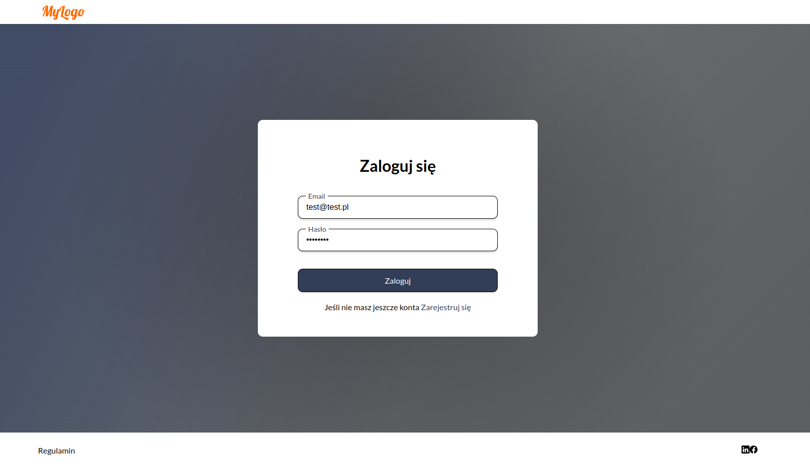

# Example react app with typescript

The application includes an example of registration, login and routing to pages with the required authorization and
public pages.

## Available Scripts

In the project directory, you can run:

### `npm start`

Runs the app in the development mode.\
Open [http://localhost:3000](http://localhost:3000) to view it in the browser.

The page will reload if you make edits.\
You will also see any lint errors in the console.

## Technologies

- React.js
- Typescript
- React Hooks
- SCSS
- axios
- i18next
- react-router-dom
- bootstrap-icons
- Webpack
